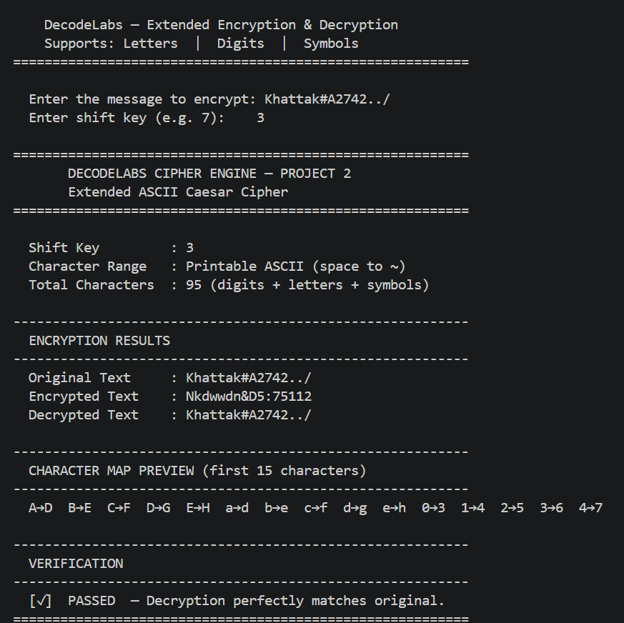

<div align="center">

# 🔐 DecodeLabs Internship — Project 2
### Extended Caesar Cipher (Full ASCII Support)

A Python implementation of an **Extended Caesar Cipher** that encrypts all **95 printable ASCII characters**, including letters, digits, symbols, punctuation, and spaces.


</div>
---

# 📑 Table of Contents

- Project Overview
- Features
- How It Works
- Project Structure
- Getting Started
- Usage
- Screenshot
- Algorithm Flow
- Code Structure
- Complexity Analysis
- Security Note
- Future Improvements
- Author
- License
---

# 📌 Project Overview

This project was developed as **Project 2** of the **DecodeLabs Cybersecurity Analyst Internship**.

It demonstrates the implementation of an **Extended Caesar Cipher** using Python.

Unlike the traditional Caesar Cipher that encrypts only alphabetic characters, this version supports the **entire printable ASCII character set (95 characters)**. This includes uppercase letters, lowercase letters, numbers, symbols, punctuation marks, and spaces.

The project focuses on understanding the fundamentals of:

- Symmetric Encryption
- ASCII Encoding
- Modular Arithmetic
- Input Validation
- Function-Based Programming

Although the Caesar Cipher is not suitable for real-world data protection, it provides an excellent foundation for learning modern cryptography.
---

# ✨ Features

- 🔐 Encrypts all printable ASCII characters
- 🔢 Encrypts digits (0–9)
- 🔣 Encrypts symbols and punctuation
- ↩️ Encrypts spaces
- ✅ Automatic decryption verification
- 🛡️ Input validation
- 📊 Character mapping preview
- ⚙️ Modular Python functions
- 📦 No external libraries required
---

# 🧠 How It Works

Each printable character is converted into its ASCII value using Python's `ord()` function.

The encryption algorithm shifts the character within the printable ASCII range using modular arithmetic.

Finally, the encrypted ASCII value is converted back into a character using Python's `chr()` function.

### Encryption Formula
E(x) = (x - 32 + shift) % 95 + 32

### Decryption Formula
D(x) = (x - 32 - shift) % 95 + 32

Where:

| Variable | Meaning |
|-----------|---------|
| x | ASCII value of the character |
| 32 | First printable ASCII character |
| 95 | Total printable ASCII characters |
| shift | User-defined encryption key |
---

# 📁 Project Structure

decodelabs-project2/
│
├── assets/
│   └── output.png
│
├── docs/
│   └── Project2_Report.docx
│
├── project2_cipher.py
├── README.md
└── LICENSE

## Prerequisites

- Python 3.x
- Visual Studio Code (Recommended)

Verify your Python installation.

python --version
---
## Clone the Repository

```bash
git clone https://github.com/adnaniqbal/decodelabs-project2.git


Move into the project directory.
cd decodelabs-project2

Run the application.

```bash
python project2_cipher.py

No external packages are required.
---
# 💻 Usage

Example input:

Enter the message:
Khattak#A2742../

Enter shift key:
3
Example output:
Original Text   : Khattak#A2742../

Encrypted Text  : Nkdwwdn&D5:75112

Decrypted Text  : Khattak#A2742../

Verification    : PASSED
---

# 📸 Program Screenshot

The screenshot below shows the successful execution of the program in Visual Studio Code.

> > **Note:** Screenshot of the program execution in Visual Studio Code.

<p align="center">
 
</p>

---

# 🔄 Algorithm Flow

```mermaid
flowchart TD

A([Start])

A --> B[Enter Plaintext]

B --> C[Enter Shift Key]

C --> D{Valid Input?}

D -- No --> B

D -- Yes --> E[Encrypt Message]

E --> F[Display Ciphertext]

F --> G[Decrypt Ciphertext]

G --> H{Verification}

H -->|Passed| I([End])

H -->|Failed| I
---
# 🔍 Code Structure

The project is organized into small, reusable functions.

| Function | Purpose |
|----------|---------|
| `encrypt_char()` | Encrypts a single character |
| `decrypt_char()` | Decrypts a single character |
| `encrypt()` | Encrypts the complete message |
| `decrypt()` | Decrypts the encrypted message |
| `get_valid_message()` | Validates message input |
| `get_valid_shift()` | Validates shift key |
| `display_results()` | Displays formatted output |
| `main()` | Program entry point |
---
# ⚡ Complexity Analysis

| Operation | Complexity |
|-----------|------------|
| Encryption | **O(n)** |
| Decryption | **O(n)** |
| Space Complexity | **O(n)** |

Where **n** is the length of the input message.
---
# 🧪 Testing

The application was tested with different input scenarios.

| Test Case | Status |
|-----------|:------:|
| Uppercase Letters | ✅ |
| Lowercase Letters | ✅ |
| Digits | ✅ |
| Symbols | ✅ |
| Spaces | ✅ |
| Mixed Characters | ✅ |
| Empty Input | ✅ |
| Invalid Shift Value | ✅ |
| Large Shift Values | ✅ |
| Encryption & Decryption Verification | ✅ |
---
# 📊 Basic Caesar vs Extended Caesar

| Feature | Basic Caesar | This Project |
|----------|--------------|--------------|
| Character Set | A–Z | Printable ASCII (95 Characters) |
| Digits | ❌ | ✅ |
| Symbols | ❌ | ✅ |
| Spaces | ❌ | ✅ |
| Modulo | 26 | 95 |
---

# 🛡️ Security Note

This implementation is intended for **educational purposes**.

While it demonstrates the principles of symmetric encryption and modular arithmetic, the Caesar Cipher is **not secure** for protecting sensitive information because:

- It has a very small key space.
- It is vulnerable to brute-force attacks.
- Character frequency remains predictable.

Modern encryption algorithms such as **AES-256** provide significantly stronger security through large key sizes and multiple encryption rounds.

---

# 🚀 Future Improvements

Possible enhancements include:

- File Encryption & Decryption
- GUI Version
- Random Key Generator
- Password-Based Encryption
- Unit Testing
- Vigenère Cipher
- AES Integration
---

# 👨‍💻 Author

**Addan Iqbal**

Cybersecurity Analyst Intern — DecodeLabs

Computer System Engineering Student

**Interests**

- Cybersecurity
- Penetration Testing
- Red Teaming
- Python
- Computer Networking

**GitHub**
https://github.com/AddanKhattak

**LinkedIn**
https://www.linkedin.com/in/addan-iqbal-4186ab247
---
# 📄 License

This project is licensed under the **MIT License**.
---
<div align="center">

### ⭐ Thank you for visiting this repository!

